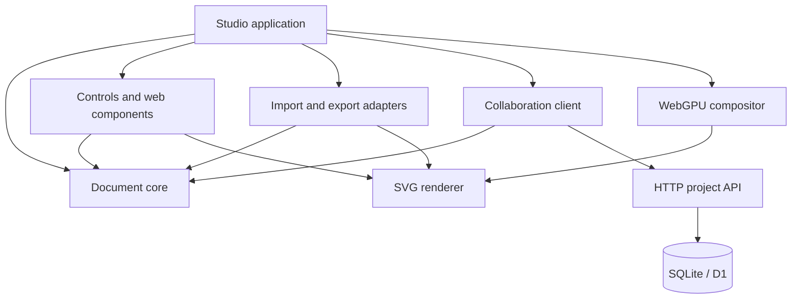

# Architecture

Vellum separates the document, renderer, browser controls, file adapters, collaboration protocol and server. The main editor is plain HTML/CSS/JavaScript. Its hosted distribution uses a thin Worker-compatible route shell; the same UI runs through a dependency-free Node HTTP server.

## Module graph

## Document model

Documents contain a format/version discriminator, stable document identity, human-readable name, pages, ordered nodes, guides, display units and color-space metadata. A node has an ID, page ID, shape type, rectangle, rotation, appearance, visibility and lock state. Specific shape data includes Bézier points or SVG path data, polygon parameters, text properties, raster data URLs and optional effects. All coordinates are device-independent CSS pixels.

The `nodes` array is the authoritative stacking order. `pageId` assigns an object to a page. `groupId` references optional nested group records with parent IDs, inherited visibility/locking and composited opacity. Child coordinates stay in document space. Group and text-thread cycles are validated. Preserved SVG nodes retain sanitized nested SVG structures; exploding a fragment is an explicit conversion with documented fidelity limits.

Validation runs before import, replacement, committed edits and server persistence. It checks IDs, page references, numeric geometry, bounded arrays, colors, gradient stops, text and path sizes, Bézier handles and allowed raster data URLs. Unknown extension fields may be carried in JSON but do not add rendering or shape-type support automatically.

## Geometry and editing

`Matrix` implements affine multiplication, inversion and point transforms. `objectMatrix` rotates and flips around object centers. World-space bounds are built from transformed corners. Analytic cubic evaluation and de Casteljau subdivision are available independently.

`SpatialIndex` partitions visible objects into a fixed-size uniform grid. Query results retain document stacking order. An object spanning more than 4,096 cells enters a coarse bucket to bound index memory. Very large region queries scan the object map instead of materializing an enormous cell list.

The studio uses broad-phase spatial queries followed by analytic ellipse checks or `Path2D` fill/stroke tests. Basic rectangles/text/images use inverse-transformed local bounds. Polygon picking currently uses its bounding rectangle; hollow ellipse picking and effect pixels are approximate. The standalone canvas component uses bounds-based picking for all shapes.

Paper.js provides curve Boolean operations, smooth/simplify, primitive conversion and compound-path manipulation. Vellum translates adapter results into normalized path nodes and retains the original editable scene independently of Paper's temporary project. Paper.js's project is cleared after operations. Hosts can inject a Paper scope implementation with `configureGeometry` for nonbrowser geometry use.

## Transactions and history

`transact(label, callback)` clones the old document, executes and validates an edit, then records a before/after history entry. Pointer gestures use `begin()`, transient mutation and `commit()` so one drag produces one undo step. Failed validation restores and reindexes the original state. Escape and pointer cancellation call `cancel()`.

History is bounded to 100 records and approximately 32 MiB of serialized UTF-16 snapshot size, retaining at least the newest record. This is a snapshot implementation, not a persistent data structure. Transient edit cost is therefore O(document size), and very large documents may retain fewer undo steps. The real-time provider uses a separate Yjs UndoManager for local shared transactions. It preserves remote changes during undo and retains local snapshot history while projecting remote state into the UI. The legacy replacement API still resets snapshot history by default.

## Rendering

`sceneTree` constructs the nested render tree in one pass over object ancestry. `SVGRenderer` maintains keyed instances for both groups and objects. Unchanged shapes retain DOM identity, group opacity is applied at the group boundary, and reparenting/order changes reconcile existing elements. Text, Bézier paths, fills, gradients, clipping and SVG effects are rendered by the browser's vector implementation.

`WebGPUCompositor` requests an adapter/device and builds a textured-quad pipeline. It rasterizes a complete SVG page through the browser into a temporary canvas, uploads that image to a GPU texture with `copyExternalImageToTexture`, and composites it into the visible WebGPU canvas. Generation tokens discard obsolete asynchronous raster results. Texture size respects the device limit and caps display supersampling at 3×. Old textures are destroyed after replacement, and GPU loss reveals the SVG fallback.

**This is a hybrid pipeline, not a native GPU path tessellator.** During direct manipulation, the SVG surface renders immediately and the old GPU layer is hidden. Once interaction settles, the compositor refreshes. Font files and face styles can be embedded in the document and SVG export. Matching font faces can be shaped through HarfBuzz into curves; linked text export uses the resolved text flow. Browser font/raster behavior still requires cross-browser qualification. Selection handles, guide lines and cursors are separate overlays. GPU performance is not represented as a proven speedup; full-page rasterization can dominate complex documents.

## UI modules

The studio provides menus, context bar, toolbox, ruled workspace, page tabs, design/object/comment dockers and a color strip. Commands use a registry and are accessible through menus, keyboard shortcuts and command search. Dialog text and user content are escaped; dynamic input values are validated before entering the document.

The independent custom elements share a `DocumentStore` and use Shadow DOM. `VellumCanvas` supports selection, drag, shape/text creation, pan, zoom and undo integration. `VellumPropertyGrid` accepts a configurable field schema. `VellumObjectTree` and `VellumColorPalette` are independent modules. These lightweight components intentionally expose fewer editing interactions than the complete studio.

## Server

`handleApi(request, env)` owns authentication, authorization, project operations, roles, comments, presence and revisions. `server/sync.js` owns Yjs validation, WebSocket sessions, chunked snapshots, exact update receipts, SQL CAS commits and audit/policy operations. `server/native.js` exposes separately bounded native conversion endpoints in the standalone runtime. It depends only on a D1-compatible prepared-statement interface. The Node adapter uses `node:sqlite` and wraps D1 `batch()` in SQLite transactions. The hosted adapter uses `cloudflare:workers` bindings. Schema changes are generated through Drizzle and committed as migrations.

All writes use parameterized SQL. The server rejects unauthenticated requests and cross-origin writes. Roles are checked for every operation, and document revisions use compare-and-swap updates. Project owners control membership; editing, commenting and viewing are distinct roles.

## Extension points

- `PluginRegistry.register({id,commands,exporters})` registers application commands and exporters.
- `CommandRegistry` exposes app-independent command discovery and execution.
- Custom-element property schemas and color arrays are configurable.
- `DocumentStore` emits `change`, `selection` and `remote` events.
- The database interface can be implemented by another persistence adapter.
- The rendering/geometry adapters can be replaced without changing stored document IDs.

Plugin code runs with host JavaScript privileges. There is no sandboxed extension marketplace, native plugin ABI or automatic unknown-shape rendering. Adding a new shape currently requires coordinated model validation, rendering, hit testing and serialization changes.

## Advanced engines

The framework-free advanced module implements editable bilinear mesh grids, four-corner envelopes and pressure/calligraphy stroke outlines. The color module loads LittleCMS WASM and performs real ICC transforms. Typography combines Unicode line breaking and bidi ordering with native browser layout and HarfBuzz outline shaping. Each module is independently exported by the npm package.

The C++ native adapter links libcdr/librevenge and returns all generated SVG pages. The native print service uses Inkscape for SVG conversion, Ghostscript for ICC/PDF/X candidate generation and pypdf for page boxes and structural checks. Exact solid process fills can bypass RGB conversion through the direct PDF path. Native processes are resource bounded and local-server-only.

All artboards are positioned on a shared canvas. The active page owns editing overlays; clicking another page changes coordinate origin before the editing gesture begins. Cross-page moves reassign the page and normalize coordinates. Page duplication remaps nested groups and text links.
